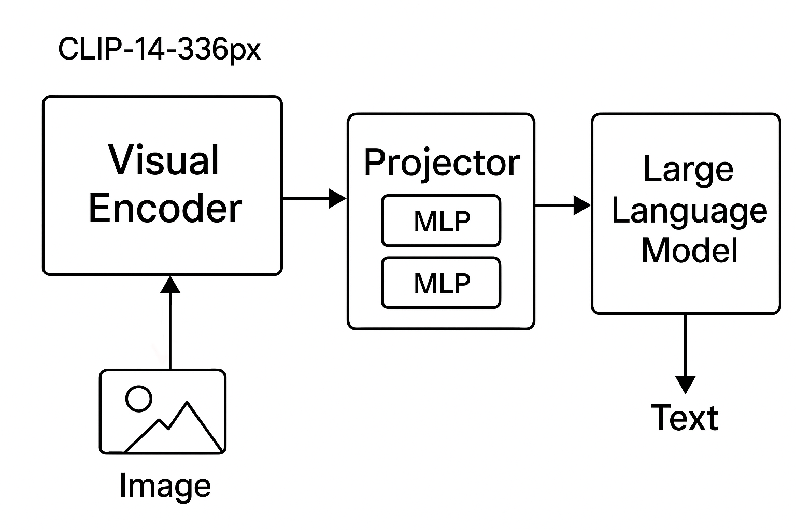

# B2P: From Buildings to People
A Large Vision-Language Model for Urban Density Estimation

**Note:** This project is a fine-tune of the [GeoChat](https://github.com/mbzuai-oryx/GeoChat) model, adapted for urban population density estimation.
## Install
```bash
# Clone the repository
git clone https://github.com/oscar0076/B2P.git
# Change directory
B2P
#
conda create -n b2p python=3.10 -y
conda activate b2p
pip install -r requires.txt
#For training cases
pip install ninja
```
## Project architecture
The project consists of a visual encoder, a projector layer, and a large language model (LLM). The visual encoder uses a pretrained CLIP-14-336px, the projector layer is composed of MLP layers used to adapt vision-tokens to language space suitable for input to a Large Language Model(Vicuna 1.5). 



The training process of our model consists of two stages: pre-training and fine-tuning.
We started from the pretrained GeoChat [model](https://huggingface.co/MBZUAI/geochat-7B) and fine-tuned it on a custom dataset designed for satellite image analysis. The goal of fine-tuning was to adapt the model for population estimation tasks, ensuring it can provide accurate results when analyzing different areas.
In addition, we prepared the model to handle related tasks such as:
  *Building counting from satellite images
  *Image classification based on population count
This fine-tuning process allows the model to better specialize in population-related applications while leveraging the strong multimodal foundation provided by GeoChat.
You can find our model in the following link: [B2P Model](https://huggingface.co/datasets/crns25/B2O)
## Evaluation
